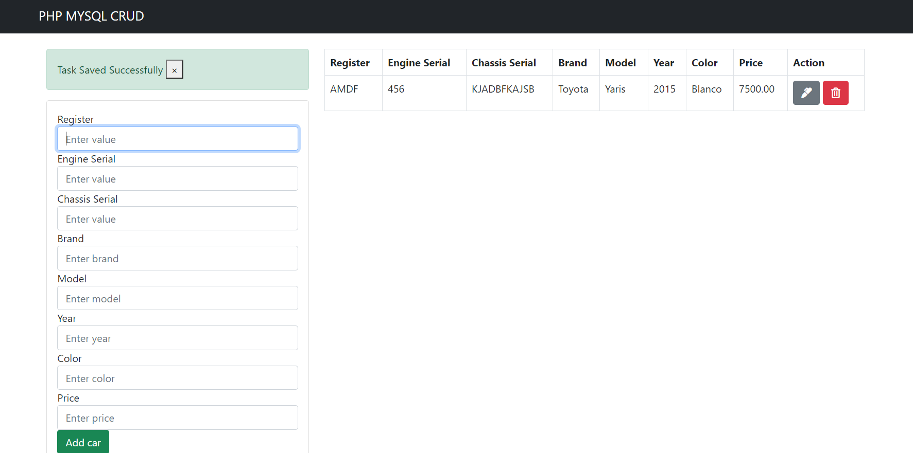

# PHP Shopping Cart

- Shopping cart

## :hammer: Built With

- PHP
- HTML
- MYSQL

## :construction_worker: Getting Started

To get a local copy up and running follow these simple example steps.

### Setup

- Open the console
- Download or git clone git@github.com:karmaester/PHP-Shopping-Cart.git
- cd PHP-Shopping-Cart

## :bust_in_silhouette: Author

👤 **Khristian Rojas**

- Github: [@githubhandle](https://github.com/karmaester)
- Twitter: [@twitterhandle](https://twitter.com/karmaendlich)
- Linkedin: [linkedin](https://www.linkedin.com/in/khristian-rojas/)

## 🤝 :raised_hand: :raised_hand: Contributing

Contributions, issues and feature requests are welcome!

Feel free to check the [issues page](https://github.com/karmaester/PHP-Shopping-Cart/issues).

## :muscle: Show your support

Give a ⭐️ if you like this project!

## :grey_exclamation: Acknowledgments

- Webslessons [tutorial](https://www.webslesson.info/2016/08/simple-php-mysql-shopping-cart.html).

## 📝 License

This project is [MIT](https://opensource.org/licenses/MIT) licensed.
